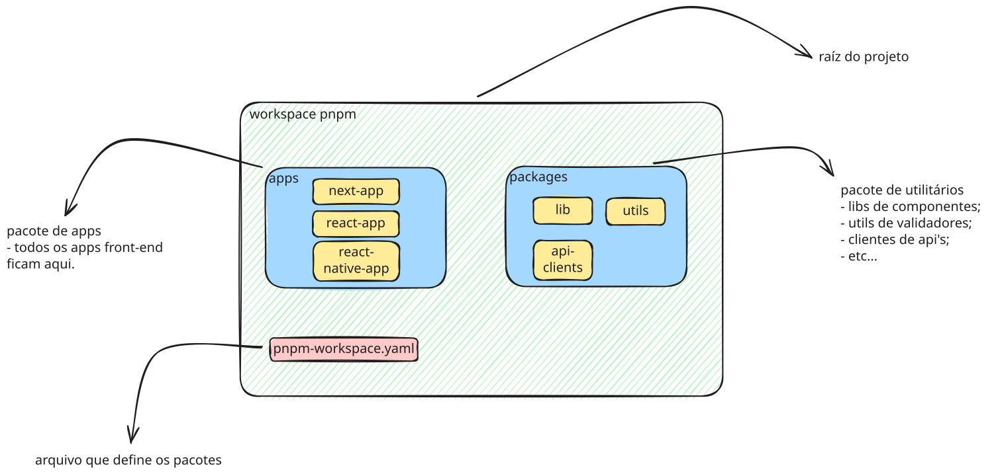

## PNPM

Esse será o nosso gerenciador de pacotes no frontend e também a tecnologia que irá definir nosso workspace.

> Vamos utilizar a versão **10.10.0**. A última versão disponível da tecnologia.

---

## EXEMPLO DA ÁRVORE DE PACOTES

```bash
├── apps  #---> *PACOTE DE APPS*
│   └── next-app  #----> *EXEMPLO DE APP*
│       ├── README.md
│       ├── eslint.config.mjs
│       ├── next-env.d.ts
│       ├── next.config.ts
│       ├── node_modules
│       ├── package.json
│       ├── public
│       │   ├── file.svg
│       │   ├── globe.svg
│       │   ├── next.svg
│       │   ├── vercel.svg
│       │   └── window.svg
│       ├── src
│       │   └── app
│       │       ├── components
│       │       │   └── ButtonWrapper.tsx
│       │       ├── favicon.ico
│       │       ├── globals.css
│       │       ├── layout.tsx
│       │       └── page.tsx
│       └── tsconfig.json
├── node_modules
├── package.json
├── packages  #---> *PACOTE DE UTILITÁRIOS E LIBS*
│   └── lib-ui  #---> *EXEMPLO DE LIB DE COMPONENTES*
│       ├── Button.tsx
│       ├── index.ts
│       ├── node_modules
│       ├── package.json
│       └── tsconfig.json
├── pnpm-lock.yaml
└── pnpm-workspace.yaml
```

---


> Componentes front-end.

---

## COMO INSTALAR

### Via terminal:

#### Usando node:
```sh
npm install -g pnpm@latest
```

#### Instalador oficial:
```sh
curl -fsSL https://get.pnpm.io/install.sh | sh -
```

---

## COMO USAR

> O pnpm é bem parecido com o npm, então não com o que se preocupar.

### ALGUNS COMANDOS BÁSICOS

Vamos repassar alguns comandos básicos do pnpm:

- adicionar uma nova dependência
```node
pnpm add react 
// adicionar a dependência para dependencies

pnpm add typescript -D 
// adicionar a dependência para devDependencies
```

- adicionar uma nova dependência do workspace (exemplo: uma lib)
```node
pnpm add lib-ui --workspace 
// adicionar a dependência do nosso próprio workspace
```

- buildar
```node
pnpm build
```

- rodar em modo dev
```node
pnpm dev
```

> **Vale ressaltar que esses comandos vão depender do contexto do terminal e também dos apps que estamos utilizando.**

O pnpm também nos permite utilizar o `--filter` que pode nos ajudar, diminuindo a necessidade de mudança de contextos no terminal. Vamos aos exemplos:

- Para adicionar uma nova dependência
```node
pnpm add --filter next-app typescript -D 
// adiciona typescript como dependência de dev
```

- Para rodar em modo dev
```node
pnpm --filter next-app dev
```

Sendo assim, não precisamos sair do contexto raíz do projeto para executar esses comandos `pnpm`.

## **PARA MAIS INFORMAÇÕES ACESSE A DOCUMENTAÇÃO OFICIAL DA TECNOLOGIA:**

Documentação PNPM: https://pnpm.io/pt/installation
